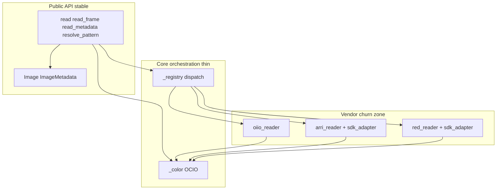
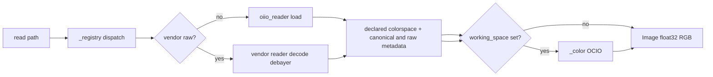

# forge-io v0.1 from sketch

## Assessment of the sketch

The design is **coherent and appropriately scoped**: one job (read pixels + metadata), explicit non-goals, a **four-function public API** (`read`, `read_frame`, `read_metadata`, `resolve_pattern`), and **OCIO only when the caller opts in** with strict config resolution (explicit arg → `OCIO` env → error). That matches how you avoid silent wrong color and removes hand-rolled log/linear approximations.

**Strengths worth keeping as-is:**

- **`Image` contract** (`float32`, `(H, W, C)`, RGB, channels-last, `source_colorspace` vs current `colorspace`) plus **canonical vs `raw_header`** metadata split (§4) so downstream tools do not depend on OIIO string stability.
- **Pattern helper separate from read** avoids repeated resolution when scanning sequences.
- **Phased vendor SDKs** avoids legal/build pain until a real consumer exists; **raw cameras** (ARRI, RED, Sony Venice, CinemaDNG) are explicitly tracked below—not afterthoughts to filesystem reads.
- **Migration narrative** for forge-align remains valid as a **follow-on integration milestone** (not part of v0.1 “done” in this repo).

**v0.1 format scope (decided):** **EXR, DPX, PNG, JPEG, TIFF** — same OIIO code path; marginal cost is zero; avoids “why not TIFF” churn.

**Sketch note:** When executing, update [forge-io-SKETCH.md](../../forge-io-SKETCH.md) `Image` / metadata wording to match **canonical + raw_header** and colorspace policy below so the sketch and code agree.

---

## Implementation sequence (when executing)

Linear order:

1. **`scaffold-package`** — `pyproject.toml` (uv), `src/forge_io/` layout, `py.typed`, minimal README stubs, **`tests/fixtures/`** and **`tests/contract/`** (see below).
2. **`types-patterns`** — `Image` / `ImageMetadata`, `resolve_pattern`.
3. **`oiio-reader`** — Public contract **§1–§4** live here (colorspace, DPX, EXR parts/layers, canonical/`raw_header`).
4. **`ocio-path`** — `_color.py`, unknown sentinel + `assume_source`.
5. **`public-api`** — Wire `read`, `read_frame`, `read_metadata`, `_registry`.

**In parallel with `oiio-reader`:** **`public-contract-doc`** — README lifts the locked rules from this plan (no dependency on code being finished).

**After the above:** **`tests-ci`** — pin ASWF image (§8), wire GitHub Actions (or equivalent), full suite green.

**`tests/contract/` (commit-one teeth):** During scaffold, add **`tests/contract/`** next to **`tests/fixtures/`**. Write **§1–§3** assertions as **failing tests first** (TDD / `@pytest.mark.xfail` or red tests until implementation lands): e.g. **`source_colorspace == "unknown"`** is the **exact** sentinel (not `None` / `""` / `"Unknown"`); **DPX** default **`unknown`** per §2; **EXR** with ambiguous beauty → **raises** the documented exception. Optionally extend contract tests for §4 canonical **`None`** keys when fixtures exist. This prevents drift while OIIO wiring lands.

---

## Public contract (lock before `oiio_reader.py`)

Treat **#1–#3** as blockers; **#4** alongside them so traffik does not couple to OIIO string drift.

### 1. `source_colorspace` — file-declared only (no path/filename heuristics)

- **Never** infer colorspace from path segments, filenames, or folder names (silent OCIO corruption).
- **Declared** means: format-specific header / metadata fields that explicitly name a colorspace or unambiguous chromaticities / OCIO role (document the exact OIIO attribute names per format in README).
- If nothing unambiguous is declared: set **`source_colorspace="unknown"`** (exact string, lowercase—**the only** reserved unknown sentinel; **no** `None`, `""`, or `"Unknown"` in API outputs).
- **`read(..., working_space=...)`** when effective source is `unknown` and **`assume_source`** is not set: **`_color.py` errors** with a message to pass **`assume_source`**. **`_color`** treats **`"unknown"`** as non-transformable unless **`assume_source`** overrides; do **not** introduce other magic strings over time.

**Per-format “declared” (initial spec, refine in code comments):**

| Format | Declared when | Else |
|--------|----------------|------|
| **EXR** | Standard attrs (e.g. `chromaticities`, `oiio:ColorSpace`, OpenEXR color space metadata) map cleanly to one OCIO-known string | `unknown` |
| **DPX** | See §2 | See §2 |
| **PNG / JPEG / TIFF** | Embedded ICC profile or explicit colorspace tag when OIIO exposes it unambiguously | `unknown` |

### 2. DPX — explicit policy

DPX header colorspace fields are **often wrong or unhelpful** in the wild. **Policy:** treat DPX as **`source_colorspace="unknown"`** unless the header contains an **unambiguous** declaration you document and test (if in practice that never happens, behavior stays “always unknown”). **Do not** silently assume Log/Cineon/print density. Any **`working_space`** transform on DPX requires **`assume_source`** (or future explicit opt-in such as `dpx_interpret_as=...`, if added—would be a deliberate API extension with warnings, not a hidden default).

### 3. Multi-part / multi-channel EXR — deterministic “beauty” selection (**parts vs layers**)

OpenEXR distinguishes **parts** (multi-part files; OIIO **subimages**) from **layers** (channel-name prefixes like `diffuse.R`, `specular.G` within one part). AOV-heavy comps usually add **layers**, not extra parts—so the algorithm must **not** treat “any subimage that has channels ending in `.R/.G/.B`” as sufficient.

**Document in README and implement in this order:**

1. **Walk each part** (OIIO subimage index `0 … n-1`) in deterministic order.
2. **Within a part**, look for a beauty RGB set in this priority:
   1. **Unprefixed** `R`, `G`, `B` channels (no layer / dot prefix in the sense documented for OIIO channel names for that part)—treat as **beauty candidate** if that triple exists and is unambiguous for the part.
   2. Else a **layer prefix** whose name is **`rgba`**, **`rgb`**, **`beauty`**, or **`Beauty`** (case rules as documented), with that layer’s `R`, `G`, `B` channels (match OIIO’s naming for layered EXRs).
3. **Across the file**, if **exactly one** part+layer candidate qualifies → use it for decode.
4. If **zero** or **multiple** candidates → **`AmbiguousExrError`** (or similar)—**no silent pick**.

**Explicit non-goal:** arbitrary `foo.R` / `foo.G` / `foo.B` layer groups are **not** considered unless `foo` is in the **allowlisted** beauty names above (extend the allowlist in README if a studio standard is missing—**ties still error**).

(Adjust allowlist in README if production files use another agreed beauty layer name.)

### 4. Metadata — canonical vs raw (OIIO churn isolation)

- **`Image`** (and `ImageMetadata` where applicable) exposes:
  - **`metadata`** (or `canonical_metadata`): **small, semver-stable** keys only — e.g. `resolution`, `pixel_aspect`, `timecode`, `framerate` (names frozen; document in README).
  - **Canonical null rule:** every canonical key is **always present**. If the format cannot carry a value (e.g. JPEG has no timecode), the value is **`None`**. Callers may use `meta["timecode"]` without `.get()`; **`None`** means absent / unknown for that field.
  - **`raw_header`** (or `raw_attrs`): **best-effort** passthrough of OIIO / vendor header keys **not** covered by semver; may change when OIIO bumps. Downstream **traffik** should prefer **canonical** fields; use `raw_header` only for debugging or explicitly documented keys.
- **Semver:** breaking changes to **canonical** keys → major bump; `raw_header` explicitly **not** semver-stable.

### 5. Reader protocol — single assembly in `read()`, no `RawFrameBundle`

**Decision (per review):** Readers **do not** apply `working_space`. Each reader returns **native pixels**, **`source_colorspace`** (per §1–§3), **canonical** + **`raw_header`**, resolution, bit depth, etc. **`read()`** alone builds the public **`Image`** (with `colorspace == source_colorspace` before OCIO) and, when `working_space` is set, calls **`_color`** to update pixels and `colorspace`. **No** `RawFrameBundle` (or equivalent “second public shape”); a **private** internal dataclass / `TypedDict` for `read_pixels()` return values is fine and stays off the semver surface.

**`read_header_only` is mandatory** on the protocol: every reader implements it so **`read_metadata()`** dispatch stays uniform (no per-reader special cases). If the SDK / OIIO has no cheap header-only API, the implementation may **fall back to** `read_pixels()` **and discard** pixel buffers—correctness over micro-performance until a faster path exists.

### 6. v0.1 “done” vs forge-align

**v0.1 done (this repo only):** four public APIs + OIIO formats above + tests/fixtures + CI + public contract README + `uv` install story.

**Out of v0.1:** **forge-align migration** is a **separate integration milestone** (separate PR/repo work). Proof of correctness for v0.1 is **forge-io’s own tests** (including OCIO golden checks), not “we migrated align.” Update sketch “What done looks like” when executing to match, or add “v0.1 library” vs “v0.2 ecosystem” wording.

### 7. TIFF / JPEG

**Included in v0.1** (same OIIO path as PNG). Already reflected in format scope above.

### 8. CI base image (pick before `tests-ci`)

**Default:** run tests in an **[ASWF](https://github.com/AcademySoftwareFoundation/aswf-docker) `ci-vfxall`-family** image (or another published ASWF image that ships **OIIO + OCIO** compatible with project pins)—**path of least resistance** for VFX stack CI. **Pin** a specific image **tag or digest** in the workflow so upgrades are deliberate. If the image is too heavy later, switch to a **documented slimmer** OIIO+OCIO image **without** changing the contract—only CI config.

---

## Implementation shape (matches your package layout)

Use the layout already specified in the sketch under `src/forge_io/`:

| Module | Responsibility |
|--------|------------------|
| [`_types.py`](src/forge_io/_types.py) | `Image`, `ImageMetadata`: **canonical** stable keys + **`raw_header`** (see Public contract §4) |
| [`_patterns.py`](src/forge_io/_patterns.py) | `resolve_pattern`: printf `%04d`, Flame `[0001-0200]`, literals |
| [`_color.py`](src/forge_io/_color.py) | Resolve OCIO config; apply transform; **`"unknown"`** effective source → **error** unless **`assume_source`** set; no other magic strings |
| [`readers/_base.py`](src/forge_io/readers/_base.py) | Protocol / ABC for readers |
| [`readers/oiio_reader.py`](src/forge_io/readers/oiio_reader.py) | OIIO read → float32 RGB; **declared-only** `source_colorspace`; **DPX/EXR rules** per Public contract; **canonical + raw_header** metadata |
| [`readers/arri_reader.py`](src/forge_io/readers/arri_reader.py) | (milestone) ARRIRAW / ARRI-linked MXF via ARRI SDK |
| [`readers/red_reader.py`](src/forge_io/readers/red_reader.py) | (milestone) R3D via RED SDK |
| [`readers/sony_reader.py`](src/forge_io/readers/sony_reader.py) | (milestone) Venice / X-OCN MXF via Sony camera SDK path |
| [`readers/cinemadng_reader.py`](src/forge_io/readers/cinemadng_reader.py) | (milestone) DNG sequence / single DNG—OIIO and/or LibRaw behind one contract |
| [`_registry.py`](src/forge_io/_registry.py) | **Discovery + dispatch only**—ordered list of readers, `can_handle(path)`, first match wins; no vendor SDK imports here |
| [`__init__.py`](src/forge_io/__init__.py) | Re-export the four public functions |

---

## Core vs vendor layers (SDK/API churn without forklift)

**Goal:** Updating ARRI/RED/Sony SDKs or swapping OIIO major versions should touch **reader adapters and tests**, not the **public API** or the **orchestration** in `read` / `read_metadata` / `_color`.

**Rules:**

1. **Frozen public surface** — Callers see only the four functions plus `Image` / `ImageMetadata` (and small, primitive optional kwargs such as `working_space`, `assume_source`, `ocio_config`). **No vendor types, handles, or SDK enums** cross the boundary. New decode options extend via **optional kwargs with defaults**, or **new canonical metadata keys** (minor semver), not signature explosions. **Unstable** header dumps live only under **`raw_header`**.

2. **Reader protocol (internal)** — `readers/_base.py` defines a narrow contract: `priority: int`, `can_read(path: Path) -> bool`, **`read_header_only(...)` (mandatory)**—fallback decode+discard allowed, `read_pixels(...)` returning **native pixels + declared `source_colorspace` + canonical + `raw_header`** (see Public contract §4–§5). **`read()`** assembles **`Image`** and applies **`_color`** when `working_space` is set—**see Public contract §5** (no `RawFrameBundle`). **Core code** (`read`, `_registry`, `_color`) depends only on this protocol, not on ARRI/RED types.

3. **Vendor isolation** — Each SDK lives behind one module (or subpackage) per vendor, e.g. `readers/arri/_sdk_adapter.py`, containing the only imports of vendor libraries. When an SDK breaks API between releases, **edit that adapter** (or add `arri_sdk_vN.py` side-by-side) and bump **`forge-io` patch/minor** per semver policy—**not** a redesign of `forge_io.read`.

4. **Registration, not hardcoded graph** — **Preferred:** `setuptools` **entry points** (e.g. group `forge_io.readers`) so optional installs (`forge-io[arri]`) register readers at import time without `_registry.py` listing every vendor. **Acceptable v0.1:** explicit in-tree registration list **if** it is a single ordered table (one place to add a row); migrate to entry points when the second vendor lands so two extras do not fight.

5. **OIIO is “just another reader”** — Same protocol as ARRI/RED; OIIO upgrades are localized to `oiio_reader.py` and possibly pin notes in packaging docs.

6. **OCIO stays orthogonal** — `_color.py` consumes **normalized** `source_colorspace` + `np.ndarray` from any reader; vendor adapters must map SDK color tags to **strings OCIO understands**. Only **`"unknown"`** is special-cased (error on transform unless **`assume_source`**); do not accept **`None`**, empty string, or variant casing as unknown. SDK color API changes do not change `_color`’s public contract.

7. **Semver policy (document in README)** — **Patch:** adapter fix for same-decode contract. **Minor:** new optional reader extra, new optional kwargs, **new canonical metadata keys** (additive). **Major:** breaking change to **canonical** metadata keys, `Image` field set, or public function signatures. **`raw_header` is explicitly unstable** across patch releases.

**`read` flow (conceptual):**

**`read_metadata`:** Always routes through each reader’s **`read_header_only`** (Public contract §5); no ad-hoc per-format branches in the public API.

**Tests:** **`tests/fixtures/`** — tiny binaries per format. **`tests/contract/`** — **public contract** tests (**§1–§3** minimum at scaffold; §4 as fixtures allow): unknown sentinel string, DPX policy, EXR ambiguity raises, plus shape/dtype/`working_space` golden checks vs a baked OCIO config where applicable.

**CI:** **Before** expanding `tests-ci`, **pin** the workflow to an **ASWF `ci-vfxall`-class** (or equivalent ASWF) container image with OIIO+OCIO—see Public contract §8. Then `uv sync`, run `pytest`.

**Packaging:** `pyproject.toml` with `numpy`, OpenImageIO Python module, and PyOpenColorIO as declared dependencies; **document** that OIIO/OCIO often need system libraries or a documented conda/container path.

---

## Raw camera roadmap (beyond simple filesystem reads)

Same public API (`read`, `read_frame`, `read_metadata`, `resolve_pattern`); **dispatch** chooses OIIO vs a vendor reader from path, magic bytes, or container signature. Raw work stays **read-only** and returns the same `Image` contract; differences live in **source colorspace** reporting, **metadata** richness, and optional **decode parameters** (added later only if needed—e.g. half-resolution debayer, highlight rolloff—behind explicit kwargs so defaults stay predictable).

| Ecosystem | Typical on-disk shapes | Practical decode path | Packaging / CI note |
|-----------|------------------------|------------------------|----------------------|
| **ARRI** | `.ari`, ARRI RAW in MXF (e.g. Codex / HDE workflows) | **ARRI RAW SDK** (official decode to scene-linear / ACES pipeline) | Cannot ship in PyPI wheel; system install + optional extra or documented internal wheel |
| **RED** | `.R3D` | **R3D SDK** | Same: proprietary redistribution; optional extra; likely no public CI decode |
| **Sony Venice** | **X-OCN** in MXF (common “original” for Venice); other Venice modes may be already-debayered or different codecs | **Sony RAW / X-OCN SDK** (or successor documented for X-OCN)—not plain OIIO for faithful camera-original decode | MXF is a **container**; sketch says container demux is out of scope—**for raw originals**, vendor SDKs often own demux+decode in one API, which still fits “read pixels from this path” if the library calls the SDK on the file or card bundle path |
| **CinemaDNG** | Folder of `.dng`, or single DNG | **Tier A:** OIIO/LibRaw if quality and camera set suffice; **Tier B:** dedicated path if a specific body needs better CFA/debayer than generic | LibRaw adds dependency and licensing clarity; validate on representative bodies you care about |

**Ordering (confirmed for planning):**

1. **ARRI first** after OIIO v0.1 (ARRIRAW / ARRI-linked MXF via ARRI RAW SDK)—proprietary milestone #1.
2. **RED** or **Sony** next depending on which shows up first in production shots (both are SDK-heavy).
3. **CinemaDNG** can move **earlier** than RED/Sony if Tier A (OIIO/LibRaw) covers your camera list—still a **matrix decision** (bodies + quality bar).

**Cross-cutting decisions to lock before coding each reader:**

- **Default debayer / output colorspace** for raw: scene-linear RGB matching vendor reference vs. native log encoding—must align with `source_colorspace` strings OCIO configs expect (document per reader).
- **`read_metadata` cost** on R3D / MXF: some SDKs expose header-only APIs; use them so traffik-style callers do not decode full frames.
- **Tests:** vendor milestones need **legal sample clips** (short, internal-only fixtures) or **mocked SDK** interfaces in CI; public CI may run only OIIO + CinemaDNG Tier A if those need no secrets.

**Sketch alignment:** This section **extends** the sketch’s Phase 2–3 list by naming **Venice/X-OCN** and **CinemaDNG** explicitly and by noting the **container vs decode** boundary (vendor SDK often collapses demux+decode for a given path string).

---

## Out of scope for v0.1 (per sketch)

- Writers, display transforms, resize, **generic** container demux (ffmpeg MOV/MP4 pipeline)—but **vendor-owned** demux+decode for a supported raw path is in scope for **post–v0.1 milestones**, not v0.1.
- `read_sequence` iterator, async, caching (document “no cache” in README).
- Vendor raw readers (ARRI, RED, Sony, CinemaDNG)—**planned and documented** here; implemented only after v0.1 OIIO path is stable unless you explicitly reprioritize.

---

## After v0.1 (separate repo / PR) — integration milestone

**Not required for v0.1 “done.”** Migrate **forge-align** in its own repo when ready: replace `cv2.imread` + normalization, delete approximate color helpers, use `forge_io.resolve_pattern`, leave container extraction in forge-align until a second consumer justifies `forge-transcode`. Track as **forge-io v0.x + forge-align PR** or a labeled milestone so proof of integration is explicit.
